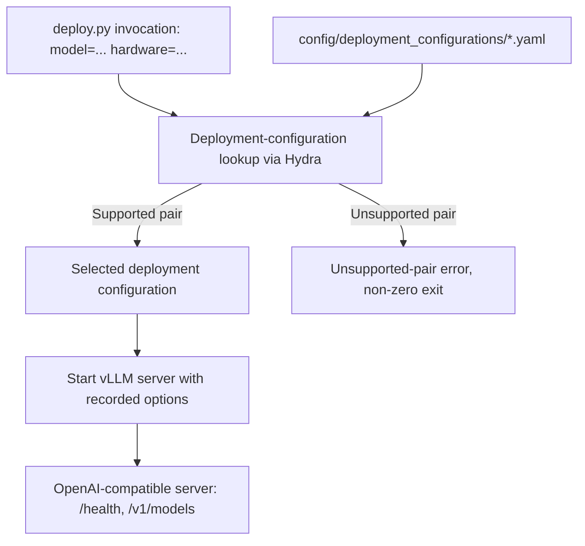

## llm-deployment constitution spec

### 1. Executive summary

#### 1.1 Project description 

A simple CLI allowing one to deploy an LLM in the most efficient way using vLLM. This CLI chooses the best options for the specified model and hardware.

#### 1.2 Project motivation

LLM deployment is a routine task with the deployment efficiency affecting the user experience significantly.

#### 1.3 Implementation repos

`llm-deployment`

#### 1.4 Execution mode

`manual`

### 2. Requirement analysis

#### 2.1 Functional requirements

**FR1**. Given a model and the type of hardware, deploy the model on this hardware via vLLM in the most efficient keeping the model accuracy virtually indistinguishable to the baseline deployment strategy (i.e., original model precision and no extra-options).

#### 2.2 Non-functional requirements

None

#### 2.3 Preferences

**P1**. Support multiple huggingface models (by their id) and multiple hardware.

**P2**. Follow the hydra-repo structure.

### 3. Acceptance criteria

Any implementation is validated by the independently managed validation service. The solution developer only sends an HTTP request to the service endpoint.

#### 3.1 Validation endpoints

Send an HTTP `POST` request with `Content-Type: application/json` to:

```text
http://localhost:8456/validate
```
to perform full (i.e., time-consuming) validation and to
```text
http://localhost:8456/validate_partial
```
to perform partial (i.e., quick) validation which is useful for debugging and diagnostic purposes.
The validation service deploys a model using the scripts from this solution subproject and run benchmarks. The request is:

```json
{
  "repo": "<clonable link to llm-deployment repository>",
  "commit": "<commit hash>",
  "solution_overrides": "<args separated by whitespaces>"
}
```

`repo` and `commit` are required strings. `solution_overrides` is optional and defaults to the empty string. For example:

```bash
curl -X POST http://localhost:8456/validate \
  -H 'Content-Type: application/json' \
  -d '{
    "repo": "<clonable link to llm-deployment repository>",
    "commit": "<commit hash>",
    "solution_overrides": ""
  }'
```

The validation service clones the specified `llm-deployment` repository, checks out the specified commit, and runs one of the deployment entry points in this project.

#### 3.2 Solution invocation

The validation service invokes one repository entry point through Hydra:

```bash
python deploy.py \
  model=<model identifier> \
  hardware=<hardware identifier>
```

The entry point:

1. Reads the requested model and hardware.
2. Resolves the matching deployment configuration from the Hydra library.
3. Starts vLLM with that deployment configuration.
4. Keeps the deployment process running so the validation service can send benchmark requests to it.
5. Returns a non-zero exit status and a clear error if the pair is unsupported or startup fails.


#### 3.3 Deployment server contract

The solution must expose a readiness check that the validation service can poll:

- The service starts the deployment process.
- The deployment serves the standard vLLM OpenAI-compatible API.
- The validation service repeatedly requests `GET /health` at the configured host and port.
- HTTP 200 means that the server is ready.
- A timeout, process exit, or non-successful response means that startup failed.

The validation service can then use `GET /v1/models` as an additional check that the expected model is loaded before running benchmarks.


#### 3.4 Validation response

A successful validation request returns HTTP 200 with one top-level object per acceptance criterion:

```json
{
  "profile": "<profile name>",
  "validation_scope": "<full or partial>",
  "AC1": {
    "status": "accepted",
    "metrics_status": {
      "VM1": {
        "computation_status": "computed",
        "acceptance_status": "accepted",
        "computed_value": 0.85,
        "expected_value_or_threshold": 0.8,
        "error_message": null
      }
    }
  }
}
```

The response contains all acceptance criteria and all metrics belonging to them. `computation_status` is `computed` or `failed_to_compute`; `acceptance_status` is `accepted`, `rejected`, or `null`; `computed_value` is the measured value or `null` when computation failed; `expected_value_or_threshold` is the condition used for that metric; and `error_message` is `null` on successful computation or describes the failure otherwise.

An acceptance criterion has status:

- `accepted` when all of its metrics were computed and satisfy their conditions;
- `valid` when all of its metrics were computed but at least one condition is not satisfied;
- `invalid` when at least one metric could not be computed.

Malformed requests, missing required fields, or fields with invalid types return an HTTP 4xx response and do not run validation. An unexpected validation-service failure returns an HTTP 5xx response.

#### 3.5 Metrics and acceptance criteria

The validation service computes the following metrics:
- **VM1. Median TTFT (seconds).**
- **VM2. Q90 TTFT (seconds).**
- **VM3. Median TPOT (seconds).**
- **VM4. Q90 TPOT (seconds).**
- **VM5. Peak VRAM (GB).**
- **VM6. Accuracy loss (percent).**

### 4. Insight

#### 4.1 Deployment-option selection

The CLI must select vLLM deployment options that balance efficiency with accuracy preservation. Two viable approaches are considered:

1. Static model-and-hardware deployment configurations

   The project maintains deployment configurations mapping supported models and hardware types to recommended vLLM options.

   Advantages:

   - Simple and predictable runtime behavior.
   - Fast deployment because no search or benchmarking is required.
   - Easy to inspect, reproduce, and validate.
   - Avoids repeated model loading and benchmark execution during deployment.
   - Allows recommendations to be reviewed and tuned explicitly.

   Disadvantages:

   - Requires maintaining combinations of models, hardware, and vLLM options.
   - Cannot automatically adapt to hardware variations that are not represented by a deployment configuration.
   - A deployment configuration may become suboptimal as vLLM, drivers, or model implementations evolve.
   - New model and hardware combinations may initially be unsupported.

2. Empirical configuration search

   The CLI generates and benchmarks multiple valid vLLM configurations on the target hardware, then selects the most efficient configuration whose accuracy remains sufficiently close to the baseline deployment.

   Advantages:

   - Adapts to the actual hardware, model, and installed software.
   - Can discover interactions between vLLM options that are difficult to model analytically.
   - Directly optimizes measured deployment behavior.

   Disadvantages:

   - Deployment takes longer because several configurations must be tested.
   - Requires a representative benchmark workload and an accuracy-evaluation procedure.
   - May require loading the model repeatedly.
   - Search cost may be high if the configuration space is large.
   - Results may vary across runs and environments.

The project chooses static model-and-hardware deployment configurations. The first version prioritizes predictable, fast, and reproducible deployment over runtime optimization through repeated benchmarking. The project will maintain a finite library of optimal deployment configurations for its supported model–hardware pairs. The library is expected to contain no more than approximately a dozen pairs, so supporting combinations outside the maintained library is not a requirement.

#### 4.2 Deployment-configuration library

Two approaches are considered for organizing the deployment configurations:

1. Central deployment-configuration library

   The CLI contains one common deployment algorithm and looks up the requested model–hardware pair in a central library. Each library entry contains the vLLM options for one supported pair.

   For example:

   ```text
   (model A, GPU A) → vLLM options ...
   (model A, GPU B) → vLLM options ...
   (model B, GPU A) → vLLM options ...
   ```

   This keeps the deployment logic shared while allowing each pair to have its own configuration. It matches the small, finite set of supported combinations and makes the library easy to inspect, validate, and extend.

2. Separate deployment implementation per pair

   The project provides a separate deployment script or implementation for each model–hardware pair. For example:

   ```text
   deploy_model_a_gpu_a.py
   deploy_model_a_gpu_b.py
   deploy_model_b_gpu_a.py
   ```

   This allows pair-specific code, but duplicates the common deployment logic and makes the supported-pair catalog harder to inspect. It is unnecessary because the supported pairs differ in their deployment options, not in the deployment algorithm.

The project chooses the central deployment-configuration library. The CLI does not need to support model–hardware combinations absent from the library. An absent pair must produce a clear unsupported-pair error. The CLI must not trigger runtime configuration search, apply an implicit fallback, or invent a configuration for such a pair.

Each library entry must define the complete vLLM configuration required for its model–hardware pair.

#### 4.3 Deployment-configuration representation

Two approaches are considered for representing entries in the deployment-configuration library:

1. Hydra configuration files

   Each model–hardware pair is represented by a Hydra configuration containing its model identifier, hardware requirements, and complete vLLM options.

   For example:

   ```text
   config/deployment_configurations/model_a_gpu_a.yaml
   config/deployment_configurations/model_a_gpu_b.yaml
   config/deployment_configurations/model_b_gpu_a.yaml
   ```

   Advantages:

   - Follows the project’s Hydra-repo preference.
   - Keeps deployment configurations separate from deployment logic.
   - Makes each deployment configuration easy to inspect and modify.
   - Allows common configuration fields and defaults to be reused.
   - Supports adding or updating a pair without changing the deployment algorithm.

   Disadvantages:

   - Configuration structure must be validated before use.
   - Some pair-specific behavior may be difficult to express if it eventually requires code.
   - The mapping between a requested pair and its configuration must be defined explicitly.

2. Python deployment-configuration objects

   Each model–hardware pair is represented by a Python object or class that contains its deployment options and potentially pair-specific behavior.

   Advantages:

   - Allows arbitrary pair-specific logic.
   - Enables validation and derived values to be implemented directly in Python.
   - Can represent complex deployment configurations more naturally than plain configuration.

   Disadvantages:

   - Mixes deployment data with deployment logic.
   - Makes the deployment-configuration library harder to inspect and edit.
   - Requires code changes when adding or changing a deployment configuration.
   - Adds unnecessary complexity when supported pairs differ only in their vLLM options.

The project chooses Hydra configuration files. The supported deployment configurations are primarily data, not separate algorithms, so they should remain separate from the common deployment code. Each configuration must identify its model–hardware pair and define the complete vLLM configuration required for that pair. The CLI must load the selected configuration through Hydra and use the common deployment algorithm to start vLLM.

### 5. Overall solution design

#### 5.1 High-level design



The deployment CLI receives a model identifier and hardware identifier through its invocation parameters. It identifies the requested model–hardware pair and looks up the corresponding deployment configuration in the central Hydra configuration library.

If the pair is supported, the CLI loads the selected configuration and uses the common deployment algorithm to start vLLM with the recorded options.

If the pair is absent from the library, the CLI reports an unsupported-pair error and does not attempt runtime configuration search or apply an implicit fallback.

#### 5.2 Core components

- Deployment CLI
  - Receives the model identifier and hardware identifier.
  - Identifies the requested model–hardware pair.
  - Looks up the corresponding deployment configuration.
  - Handles unsupported pairs.
  - Starts vLLM using the selected configuration.

- Hydra deployment-configuration library
  - Stores one deployment configuration for each supported model–hardware pair.
  - Defines the vLLM options for each pair.

- Common vLLM deployment logic
  - Loads the selected deployment configuration.
  - Uses the vLLM serving interface to construct and start the deployment.
  - May use the vLLM Python API or invoke the vLLM command-line interface, depending on the implementation choice.

- vLLM, used as the deployment backend.


