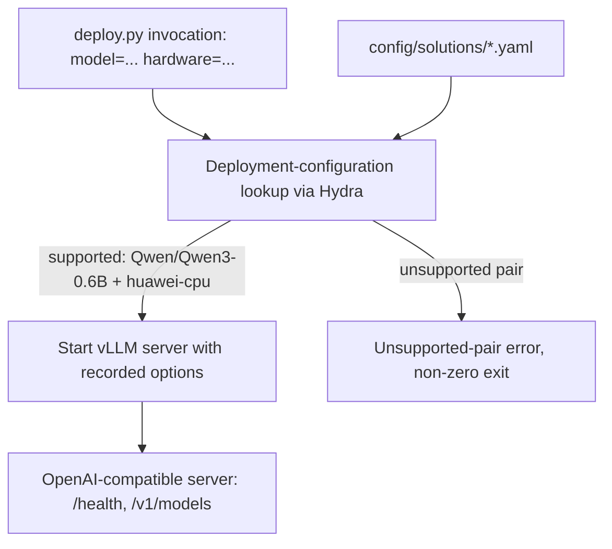

## Baseline skeleton (kiss spec)

### 1. Requirement analysis

**R1.** The repository must provide the deployment entry point `deploy.py` invoked as

```bash
python deploy.py model=<model identifier> hardware=<hardware identifier>
```

through Hydra. It must read the two identifiers, resolve the deployment configuration for the model-hardware pair, and start the deployment server.

**R2.** The deployment configuration library must live in `config/solutions/` as one Hydra configuration per supported model-hardware pair, each defining the complete vLLM options for that pair (constitution spec sections 4.2/4.3).

**R3.** The first supported pair is `Qwen/Qwen3-0.6B` (HuggingFace id) with hardware `huawei-cpu` (this machine: 8-core CPU, 15 GB RAM, no GPU). Its deployment configuration is the baseline deployment strategy: original model precision, no extra vLLM options beyond what CPU deployment requires (CPU device selection is part of the pair's configuration, not an "extra option").

**R4.** A requested pair absent from the library must produce a clear unsupported-pair error and a non-zero exit status; no runtime search, no implicit fallback.

**R5.** The started deployment server must expose the standard vLLM OpenAI-compatible API, respond with HTTP 200 on `GET /health` when ready, and list the deployed model on `GET /v1/models`. The entry point must keep serving (not exit) so the validation service can benchmark it.

**B1.** Model identifier variants: only `Qwen/Qwen3-0.6B` is supported in this spec; any other model identifier is an unsupported pair (R4).

**B2.** Hardware identifier variants: only `huawei-cpu` is supported in this spec; any other hardware identifier is an unsupported pair (R4).

### 2. Tests

**T1** (R1, R3, R5). Start `python deploy.py model=Qwen/Qwen3-0.6B hardware=huawei-cpu`; poll `GET /health` until HTTP 200; assert `GET /v1/models` lists `Qwen/Qwen3-0.6B`; send one chat completion and assert a non-empty completion. Marked manual: requires model download and real serving; not committed to the test suite, outcome recorded in the implementation summary.

**T2** (R4, B1/B2). Run `deploy.py` with an unsupported model and with an unsupported hardware identifier; assert a clear error message naming the unsupported pair and exit status != 0, with no server started. Automated.

**T3** (R2). Assert every file in `config/solutions/` defines a model identifier, hardware identifier and vLLM options, and that the `(Qwen/Qwen3-0.6B, huawei-cpu)` entry exists. Automated.

### 3. Implementation plan

#### 3.1 Implementation repos

`llm-deployment`

#### 3.2 High-level design



This follows the constitution spec section 5.1 design directly: the CLI, lookup, library and deployment-server components are exactly the ones the constitution defines; this spec instantiates them with one library entry.

#### 3.3 Todo list

1. [ ] Write the tests
2. [ ] Run all the tests and ensure that they fail
3. [ ] Create the Hydra config structure: `config/config.yaml` with `model`/`hardware` groups and `config/solutions/qwen3_0_6b_huawei_cpu.yaml`
4. [ ] Implement `deploy.py`: pair lookup, unsupported-pair error, vLLM startup (CPU device), serving until terminated
5. [ ] Create a project venv with vLLM (requires user permission for package installation)
6. [ ] Run the automated tests (T2, T3) until green
7. [ ] Run the manual test (T1) end-to-end with real serving and record the outcome

#### 3.4 Modification summary

| File | Action |
|------|--------|
| `deploy.py` | New: deployment entry point |
| `config/config.yaml` | New: Hydra defaults with `model`/`hardware` groups |
| `config/model/qwen3_0_6b.yaml` | New: model identifier config |
| `config/hardware/huawei_cpu.yaml` | New: hardware identifier config |
| `config/solutions/qwen3_0_6b_huawei_cpu.yaml` | New: baseline deployment configuration |
| `tests/test_deploy.py` | New: T2, T3 |
