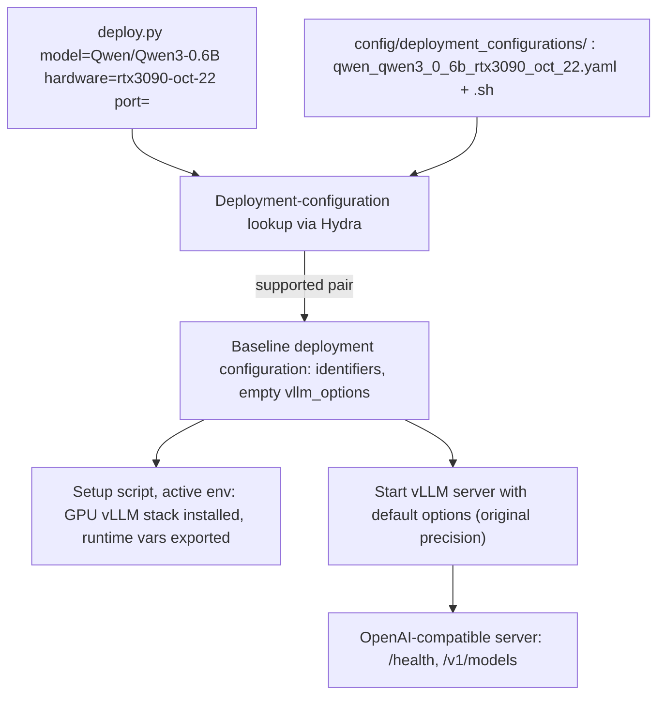

## rtx3090-oct-22 deployment configuration (kiss spec)

### 1. Requirement analysis

**R1.** The deployment-configuration library must gain the entry for the model-hardware pair (`Qwen/Qwen3-0.6B`, `rtx3090-oct-22`). Both files must be named by the pair slug rule of the constitution spec (section 4.3): `config/deployment_configurations/qwen_qwen3_0_6b_rtx3090_oct_22.yaml` and `config/deployment_configurations/qwen_qwen3_0_6b_rtx3090_oct_22.sh`.

**R2.** The new entry must be the baseline deployment strategy (terminology document: original model precision, no extra deployment options). Its `vllm_options` must therefore be empty: no quantization, no `dtype` override, no tensor-parallel or memory-related option. It is the reference point for the further improvements, so it must stay free of tuning that belongs to later specs.

**R3.** The pair's environment setup script must prepare the target host environment so that the existing entry point works unchanged: install the GPU build of vLLM into the active Python environment (idempotently) and export the runtime variables the GPU stack requires on this host. No change to `deploy.py`, the library format or the unsupported-pair behavior is required.

**R4.** The pair must be verified on the target host itself (`rtx3090-oct-22`, 1x RTX 3090 24 GB): the deployment must reach the readiness state and serve requests, per the deployment server contract of the constitution spec (section 3.3). The verification must not use any pre-existing Python environment on the host — it uses a fresh one, which is removed afterwards.

**R5.** The existing (`Qwen/Qwen3-0.6B`, `huawei-cpu`) entry and the unsupported-pair behavior for every other pair must remain unchanged.

**B1.** Model identifier variants: only `Qwen/Qwen3-0.6B` is supported. It is deliberately the same model as the `huawei-cpu` entry, so that the two library entries differ in hardware only and are comparable. Any other model identifier is an unsupported pair.

**B2.** Hardware identifier variants: the hardware identifier of the new pair is exactly `rtx3090-oct-22` (the host it is validated on). Any other hardware identifier, including other spellings of the same GPU (e.g. `rtx3090-24gb`), is an unsupported pair: no fallback, no aliasing.

**B3.** Host-state variants for R4: the model may already be present in the host's HuggingFace cache or may be downloaded on first start. The deployment must work in both cases (vLLM resolves the HuggingFace model id itself), so the setup script must not depend on the model cache being pre-populated.

### 2. Tests

**T1** (R1, R2, B1, B2). Assert that the library contains an entry with model `Qwen/Qwen3-0.6B` and hardware `rtx3090-oct-22`; that its file name equals the pair slug derived from those identifiers by the section 4.3 rule (underscore-joined, lowercased, non-alphanumeric replaced by underscore); that its `vllm_options` mapping is empty (R2); and that a setup script with the same slug exists next to it. Automated.

**T2** (R5, B2). Assert that a near-miss hardware identifier (`rtx3090-24gb`) and an unknown model identifier both produce the unsupported-pair error and a non-zero exit status, and that the `huawei-cpu` entry is still present and unchanged in shape. Automated.

**T3** (R3, R4, B3). Manual, on `rtx3090-oct-22`: create a fresh Python environment on the host, run the pair's setup script with it active, run `python deploy.py model=Qwen/Qwen3-0.6B hardware=rtx3090-oct-22 port=<port>`, poll `GET /health` until HTTP 200, assert `GET /v1/models` lists `Qwen/Qwen3-0.6B`, send one chat completion and assert a non-empty completion, stop the deployment and remove the fresh environment. Marked manual: requires the GPU host; its outcome is recorded in the implementation summary.

**Note on the validation service.** The validation service runs on this machine and its profile pins the validated pair to `huawei-cpu` with the peak-VRAM criterion out of scope because there is no GPU here. It therefore cannot deploy or measure this pair, and this spec claims no validation-service result; T3 on the target host is the evidence for this spec.

### 3. Implementation plan

#### 3.1 Implementation repos

`llm-deployment`

#### 3.2 High-level design

The design is the constitution spec section 5.1 design instantiated for one more library entry: the CLI, the lookup, the library and the deployment server are unchanged, and only the library content is extended (one yaml, one setup script).

#### 3.3 Todo list

1. [ ] Write the tests
2. [ ] Run all the tests and ensure that they fail
3. [ ] Create `config/deployment_configurations/qwen_qwen3_0_6b_rtx3090_oct_22.yaml` (pair identifiers plus the complete vLLM options of the baseline strategy: no extra options)
4. [ ] Create `config/deployment_configurations/qwen_qwen3_0_6b_rtx3090_oct_22.sh` (idempotent: install the GPU vLLM stack into the active environment, export the host's required runtime variables)
5. [ ] Run the automated tests (T1, T2) until green
6. [ ] Run the manual test (T3) on `rtx3090-oct-22` with a fresh environment and record the outcome
7. [ ] Remove the fresh environment from the host

#### 3.4 Modification summary

| File | Action |
|------|--------|
| `config/deployment_configurations/qwen_qwen3_0_6b_rtx3090_oct_22.yaml` | New: baseline deployment configuration for the (Qwen/Qwen3-0.6B, rtx3090-oct-22) pair |
| `config/deployment_configurations/qwen_qwen3_0_6b_rtx3090_oct_22.sh` | New: environment setup script for that pair |
| `tests/test_deploy.py` | Modified: add T1 and T2 for the new pair |
