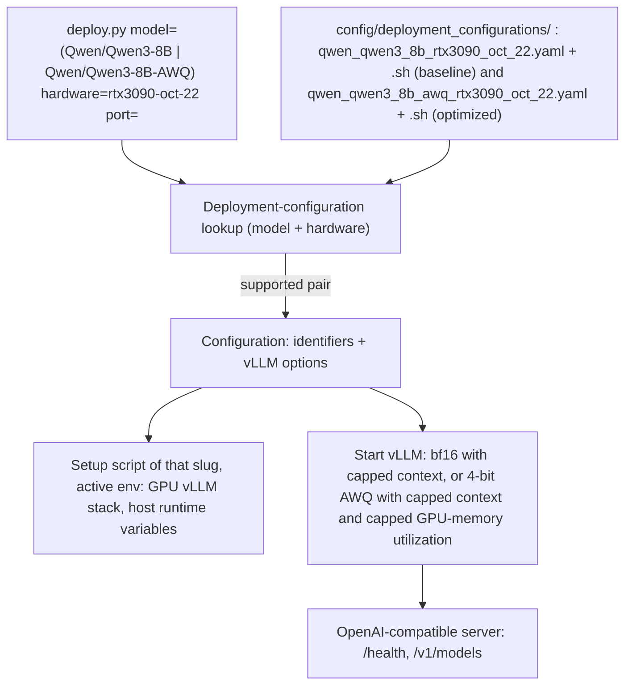

## Qwen3-8B on rtx3090-oct-22 deployment configurations (kiss spec)

### 1. Requirement analysis

**R1.** The deployment-configuration library must gain the entry for the model-hardware pair (`Qwen/Qwen3-8B`, `rtx3090-oct-22`). Both files must be named by the pair-slug rule of the constitution spec (section 4.3): `config/deployment_configurations/qwen_qwen3_8b_rtx3090_oct_22.yaml` and `config/deployment_configurations/qwen_qwen3_8b_rtx3090_oct_22.sh`. Its `vllm_options` must be exactly `max_model_len: 24576`: the vLLM default max model length (40960) does not fit on the 24 GB card — the KV cache needs 5.62 GiB against 4.54 GiB available after the bf16 weights and the CUDA graphs are placed, and the engine core refuses to start — and 24576 keeps the context far above what this pair's evaluation needs (~1300 tokens per request). This entry is the pair's baseline: original model precision, no tuning beyond what the pair requires to start.

**R2.** The library must gain the optimized deployment configuration of the same model on the same hardware, serving the model's 4-bit AWQ release: pair (`Qwen/Qwen3-8B-AWQ`, `rtx3090-oct-22`), files `config/deployment_configurations/qwen_qwen3_8b_awq_rtx3090_oct_22.yaml` and `.sh` by the same slug rule. Rationale: the bf16 deployment cannot satisfy the pair's acceptance criteria — moving the bf16 weights alone (15.27 GiB) across the host's 936 GB/s costs at least ~17.5 ms per output token (VM3 requires < 10 ms) and those weights already exceed the whole peak-VRAM budget before any KV cache is allocated (VM5 requires < 16). The 4-bit release is the same model at half a byte per parameter, so this remains the model's own deployment and not a substitute model.

**R3.** The optimized entry's `vllm_options` must be exactly `max_model_len: 24576` and `gpu_memory_utilization: 0.6`: the same context cap as R1, plus a GPU-memory-utilization cap that holds the complete footprint (quantized weights, KV cache, CUDA graphs) under the peak-VRAM budget. The KV cache left by that cap (measurement: 6.52 GiB, 47,472 tokens) must stay far above the evaluation's concurrent working set (~1300 tokens per request, 8 concurrent requests).

**R4.** Each entry must ship the environment setup script of its own slug. The scripts must prepare the target host environment so that the existing entry point works unchanged: install the GPU build of vLLM into the active Python environment (idempotently) and apply the runtime variables the GPU stack requires on this host. No change to `deploy.py`, the library format or the unsupported-pair behavior is required.

**R5.** Both entries must be verified on the target host itself (`rtx3090-oct-22`, 1x RTX 3090 24 GB): each deployment must reach the readiness state and serve requests, per the deployment server contract of the constitution spec (section 3.3), and the verification must not use any pre-existing Python environment on the host — it uses a fresh one, which is removed afterwards. The optimization must be evidenced by measurement: for the optimized entry, the median TPOT of 8 concurrent streams and the peak GPU memory during generation.

**R6.** The optimized entry must be validated by the validation service (constitution spec section 3): partial validation of the commit that carries it must return AC3 and AC5 accepted — the two criteria the bf16 deployment rejects — with the remaining criteria unchanged.

**R7.** The existing (`Qwen/Qwen3-0.6B`, `huawei-cpu`) entry and the unsupported-pair behavior for every other pair must remain unchanged.

**B1.** Model identifier variants: only `Qwen/Qwen3-8B` and `Qwen/Qwen3-8B-AWQ` are supported for this hardware. Any other identifier — including the FP8 release, the GPTQ releases and any other quantization — is an unsupported pair. Online 8-bit quantization of the bf16 checkpoint is deliberately out of scope: it fails on this host's stack (torch inductor assertion during engine initialisation), so it cannot be the optimization route.

**B2.** Hardware identifier variants: the hardware identifier of both pairs is exactly `rtx3090-oct-22` (the host they are verified on). Any other hardware identifier, including other spellings of the same GPU (e.g. `rtx3090-24gb`), is an unsupported pair: no fallback, no aliasing.

**B3.** Host-state variants for R5: neither checkpoint must be present in the host's HuggingFace cache; the first start of a deployment downloads it (~16.4 GB for the bf16 entry, ~5.7 GiB for the AWQ entry). vLLM resolves the HuggingFace model id itself, so no setup script must depend on a pre-populated cache.

### 2. Tests

**T1** (R1, R2, R3, B1, B2). Assert that the library contains the entry with model `Qwen/Qwen3-8B` and hardware `rtx3090-oct-22` whose file name equals the pair slug, with `vllm_options` exactly `{max_model_len: 24576}`; that it contains the entry with model `Qwen/Qwen3-8B-AWQ` and hardware `rtx3090-oct-22` whose file name equals the pair slug, with `vllm_options` exactly `{max_model_len: 24576, gpu_memory_utilization: 0.6}`; and that a setup script with each slug exists next to its yaml. Automated.

**T2** (R7, B1, B2). Assert that a near-miss hardware identifier (`rtx3090-24gb`) and an unsupported model identifier (`Qwen/Qwen3-8B-FP8`) both produce the unsupported-pair error and a non-zero exit status, and that the `huawei-cpu` entry is still present and unchanged in shape. Automated.

**T3** (R4, R5, B3). Manual, on `rtx3090-oct-22`: create a fresh Python environment on the host, run each pair's setup script with it active, run `python deploy.py model=<pair model> hardware=rtx3090-oct-22 port=<port>`, poll `GET /health` until HTTP 200, assert `GET /v1/models` lists the pair's model, send one chat completion and assert a non-empty completion. For the optimized entry, additionally measure the median TPOT of 8 concurrent streams and the peak GPU memory during generation, and assert the median TPOT is below 0.01 s and the peak GPU memory below 16 GiB. Stop the deployments and remove the fresh environment. Marked manual: requires the GPU host; its outcome is recorded in the implementation summary.

**T4** (R6). Manual: send `POST /validate_partial` to the validation service for the commit that carries the optimized entry, with the service profile pinned to the optimized pair, and record the returned criterion statuses. The validation service runs on the target host. Its profile must pin `model: Qwen/Qwen3-8B-AWQ` with `hardware: rtx3090-oct-22`; a profile pinned to the bf16 pair cannot exercise the optimization, because the entry point resolves the deployment configuration by the requested pair.

**Note on the accuracy metric.** The service's `baseline.commit` must be a commit of this repository that carries the pair being validated, so for the optimized pair it can only be the commit under test itself (as already holds for the bf16 pair). `VM6` (accuracy loss) is therefore 0 by construction and is not evidence about the 4-bit release's accuracy. Measuring that would need a service capability to compare two different pairs, which is out of this spec's scope.

### 3. Implementation plan

#### 3.1 Implementation repos

`llm-deployment`

#### 3.2 High-level design

The design is the constitution spec section 5.1 design instantiated for two more library entries: the CLI, the lookup, the library and the deployment server are unchanged, and only the library content is extended (two yaml files, two setup scripts). The two entries differ in the served weights (bf16 versus its 4-bit release) and in the utilization cap that turns the quantized weights into a smaller footprint.

#### 3.3 Todo list

1. [ ] Write the tests
2. [ ] Run all the tests and ensure that they fail
3. [ ] Create `config/deployment_configurations/qwen_qwen3_8b_rtx3090_oct_22.yaml` and `.sh` (pair identifiers, `max_model_len: 24576`, setup script)
4. [ ] Create `config/deployment_configurations/qwen_qwen3_8b_awq_rtx3090_oct_22.yaml` and `.sh` (4-bit AWQ model identifier, `max_model_len: 24576` and `gpu_memory_utilization: 0.6`, setup script)
5. [ ] Run the automated tests (T1, T2) until green
6. [ ] Run the manual test (T3) on `rtx3090-oct-22` with a fresh environment, measure the optimized entry, record the outcome
7. [ ] Remove the fresh environment from the host
8. [ ] Run the validation test (T4) and record the criterion statuses

#### 3.4 Modification summary

| File | Action |
|------|--------|
| `config/deployment_configurations/qwen_qwen3_8b_rtx3090_oct_22.yaml` | New: baseline deployment configuration for the (Qwen/Qwen3-8B, rtx3090-oct-22) pair |
| `config/deployment_configurations/qwen_qwen3_8b_rtx3090_oct_22.sh` | New: environment setup script for that pair |
| `config/deployment_configurations/qwen_qwen3_8b_awq_rtx3090_oct_22.yaml` | New: optimized deployment configuration for the (Qwen/Qwen3-8B-AWQ, rtx3090-oct-22) pair |
| `config/deployment_configurations/qwen_qwen3_8b_awq_rtx3090_oct_22.sh` | New: environment setup script for that pair |
| `tests/test_deploy.py` | Modified: add T1 and T2 for both pairs |
