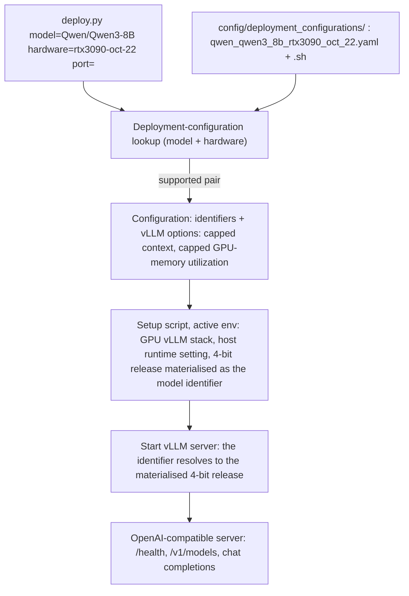

## Qwen3-8B on rtx3090-oct-22 deployment configuration (kiss spec)

### 1. Requirement analysis

**R1.** The deployment-configuration library must gain the entry for the model-hardware pair (`Qwen/Qwen3-8B`, `rtx3090-oct-22`). Both files must be named by the pair-slug rule of the constitution spec (section 4.3): `config/deployment_configurations/qwen_qwen3_8b_rtx3090_oct_22.yaml` and `config/deployment_configurations/qwen_qwen3_8b_rtx3090_oct_22.sh`. The entry keeps the model identifier `Qwen/Qwen3-8B`, because the caller resolves a deployment by the pair's identifiers (the validation service of the constitution spec section 3 always calls this pair by that identifier).

**R2.** The pair's deployment must serve the model's 4-bit AWQ release, under the model identifier of R1. The plain bf16 deployment cannot satisfy the pair's acceptance criteria on this hardware: moving the bf16 weights (15.27 GiB) across this card's 936 GB/s costs at least ~17.5 ms per output token (VM3 requires < 0.01 s), and those weights alone already exceed the whole peak-VRAM budget (VM5 requires < 16 GB), before any KV cache is allocated. The 4-bit release halves the bytes per parameter and satisfies both. The optimization must be carried by the deployment configuration, not by the entry point or the library format: the entry point resolves the deployment by the model identifier, and vLLM resolves a model identifier as a local path when such a path exists, so the pair's setup script materialises the identifier as a local directory that holds the AWQ release, and the deployment (which runs with the repository root as its working directory) serves those 4-bit weights under the model identifier. Offline quantization of the bf16 checkpoint is not a route on this host: vLLM's online fp8 quantization fails during engine initialisation (torch inductor assertion).

**R3.** The entry's `vllm_options` must be exactly `max_model_len: 24576` and `gpu_memory_utilization: 0.6`. The context cap keeps one full sequence servable and stays far above what the evaluation needs (~1300 tokens per request): the vLLM default (40960) does not even fit this card, because its KV cache would need 5.62 GiB against 4.54 GiB available after the bf16 weights and the CUDA graphs. The utilization cap holds the complete footprint (weights, KV cache, CUDA graphs) below the peak-VRAM budget and still leaves a KV cache of 7.52 GiB (54,784 tokens), far above the evaluation's concurrent working set.

**R4.** The pair's setup script must prepare the target host environment so that the existing entry point works unchanged, and it must be idempotent: install the GPU build of vLLM into the active Python environment, apply the runtime variables the GPU stack requires on this host, download the 4-bit release if it is not present, and materialise the model identifier as the local directory of R2.

**R5.** The pair must be verified on the target host itself (`rtx3090-oct-22`, 1x RTX 3090 24 GB): the deployment must reach the readiness state and serve requests, per the deployment server contract of the constitution spec (section 3.3), and the verification must not use any pre-existing Python environment on the host — it uses a fresh one, which is removed afterwards. The optimization must be evidenced by measurement: the median TPOT of 8 concurrent streams (below 0.01 s), the peak GPU memory during generation (below 16 GiB), and the engine's own loading footprint of the quantized weights.

**R6.** The pair must be validated by the validation service (constitution spec section 3): partial validation of the commit that carries this entry must return AC3 and AC5 accepted — the two criteria the bf16 deployment rejects — with the remaining criteria unchanged.

**R7.** The existing (`Qwen/Qwen3-0.6B`, `huawei-cpu`) entry and the unsupported-pair behavior for every other pair must remain unchanged.

**B1.** Model identifier variants: the only supported model identifier for this hardware is `Qwen/Qwen3-8B`. The weights repository of R2 (`Qwen/Qwen3-8B-AWQ`) is a source of weights the deployment prepares, not a pair of the library: requesting it as a pair is an unsupported pair, like any other identifier (including the FP8 and GPTQ releases).

**B2.** Hardware identifier variants: the hardware identifier of the pair is exactly `rtx3090-oct-22` (the host it is verified on). Any other hardware identifier, including other spellings of the same GPU (e.g. `rtx3090-24gb`), is an unsupported pair: no fallback, no aliasing.

**B3.** Host-state variants for R5: the 4-bit release may already be present in the host's HuggingFace cache or may be downloaded by the setup script. The deployment must work in both cases, so the setup script must not depend on the cache being pre-populated.

### 2. Tests

**T1** (R1, R2, R3, B1, B2). Assert that the library contains an entry with model `Qwen/Qwen3-8B` and hardware `rtx3090-oct-22`; that its file name equals the pair slug derived from those identifiers by the section 4.3 rule (underscore-joined, lowercased, non-alphanumeric replaced by underscore); that its `vllm_options` equals `{max_model_len: 24576, gpu_memory_utilization: 0.6}` (R3); that a setup script with the same slug exists next to it; and that this script prepares the 4-bit release of R2 (it names the weights repository). Automated.

**T2** (R7, B1, B2). Assert that a near-miss hardware identifier (`rtx3090-24gb`) and, as model identifiers, both an unknown model (`org/does-not-exist`) and the weights repository of R2 (`Qwen/Qwen3-8B-AWQ`) produce the unsupported-pair error and a non-zero exit status, and that the `huawei-cpu` entry is still present and unchanged in shape. Automated.

**T3** (R4, R5, B3). Manual, on `rtx3090-oct-22`: create a fresh Python environment on the host, run the pair's setup script with it active, run `python deploy.py model=Qwen/Qwen3-8B hardware=rtx3090-oct-22 port=<port>`, poll `GET /health` until HTTP 200, assert `GET /v1/models` lists `Qwen/Qwen3-8B` with the capped context, and send one chat completion asserting a non-empty completion. Assert that the deployment really serves the 4-bit release: the engine reports the quantized model's loading footprint (~5.7 GiB) rather than the bf16 one (~15.3 GiB). Measure the median TPOT of 8 concurrent streams and the peak GPU memory during generation and assert they are below the thresholds of R5. Stop the deployment, remove the fresh environment and the materialised identifier. Marked manual: requires the GPU host; its outcome is recorded in the implementation summary.

**T4** (R6). Manual: send `POST /validate_partial` to the validation service for the commit that carries this entry and record the returned criterion statuses. The service's profile pins the pair (`model: Qwen/Qwen3-8B`, `hardware: rtx3090-oct-22`) and its baseline commit is the pair's bf16 configuration, so `VM6` compares the 4-bit deployment against the bf16 one.

### 3. Implementation plan

#### 3.1 Implementation repos

`llm-deployment`

#### 3.2 High-level design

The design is the constitution spec section 5.1 design instantiated for one more library entry: the CLI, the lookup, the library format and the deployment server are unchanged. The pair's deployment configuration carries the optimization: the yaml holds the two vLLM options of R3, and the setup script prepares the 4-bit weights and the local path the model identifier resolves to.

#### 3.3 Todo list

1. [ ] Write the tests
2. [ ] Run all the tests and ensure that they fail
3. [ ] Create `config/deployment_configurations/qwen_qwen3_8b_rtx3090_oct_22.yaml` (pair identifiers, capped context, capped GPU-memory utilization)
4. [ ] Create `config/deployment_configurations/qwen_qwen3_8b_rtx3090_oct_22.sh` (idempotent: install the GPU vLLM stack into the active environment, apply the host runtime setting, prepare the 4-bit release and the local path of the identifier)
5. [ ] Run the automated tests (T1, T2) until green
6. [ ] Run the manual test (T3) on `rtx3090-oct-22` with a fresh environment and record the measured numbers
7. [ ] Remove the fresh environment and the materialised identifier from the host
8. [ ] Run the validation test (T4) and record the criterion statuses

#### 3.4 Modification summary

| File | Action |
|------|--------|
| `config/deployment_configurations/qwen_qwen3_8b_rtx3090_oct_22.yaml` | New: deployment configuration for the (Qwen/Qwen3-8B, rtx3090-oct-22) pair |
| `config/deployment_configurations/qwen_qwen3_8b_rtx3090_oct_22.sh` | New: environment setup script for that pair; also prepares the 4-bit release the deployment serves |
| `.gitignore` | Modified: ignore the local directory the pair's deployment materialises its model identifier as |
| `tests/test_deploy.py` | Modified: add T1 and T2 for the pair |
