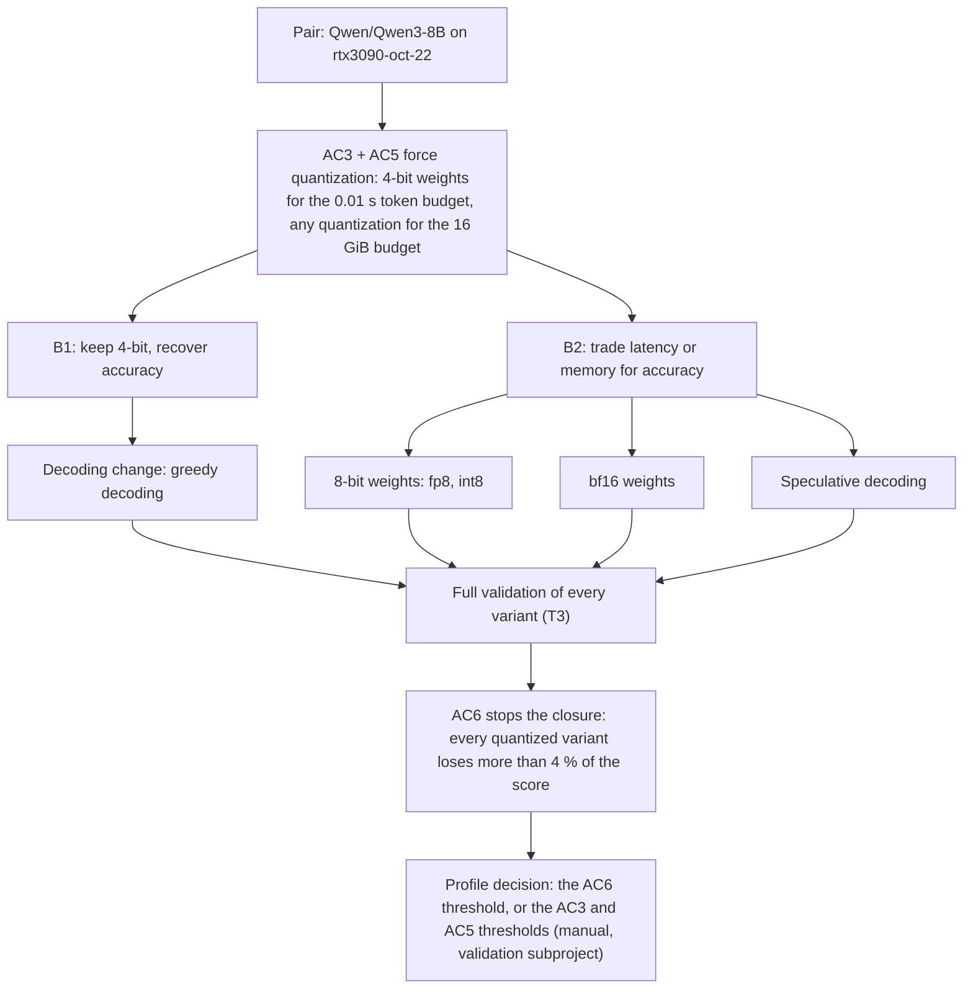

## Qwen3-8B accuracy closure on rtx3090-oct-22 (kiss spec)

### 1. Requirement analysis

**R1.** The deployment configuration of the (`Qwen/Qwen3-8B`, `rtx3090-oct-22`) pair must accept every acceptance criterion of the pair's profile (`rtx3090_oct_22`) under full validation. Spec 03 leaves AC6 rejected: the 4-bit deployment loses 5.539 % of the evaluation's quality score against the profile's bf16 baseline, and AC6 requires a loss below 1 %. The two criteria that the 4-bit deployment solves (AC3: median TPOT below 0.01 s; AC5: peak GPU memory below 16 GiB) are the reason the pair exists, so the closure must not drop them.

**R2.** The closure must stay inside the deployment configuration: the entry point, the library format and every other library entry stay unchanged (spec 03, R7). A change of the pair's identifiers is not an option, because the validation service always calls this pair by them.

**R3.** Any measured accuracy loss must be attributable to the deployment, not to the measurement. The evaluation must be shown to be reproducible, and its resolution must be established by a control measurement before a loss is accepted as real.

**B1.** Variants that keep the 4-bit deployment and recover accuracy inside it: a decoding change (pinned greedy decoding against the model's generation config), a finer-grained 4-bit scheme, or a mixed-precision scheme.

**B2.** Variants that trade latency or memory for accuracy: 8-bit weights (the fp8 and the int8 releases), the bf16 weights, and speculative decoding on top of a quantized deployment.

### 2. Tests

**T1** (R3). Manual, on the validation service: run a full validation of an unchanged deployment twice and compare VM6. Both runs must return the same value, so the criterion is reproducible.

**T2** (R3, B1). Manual, on the validation service: run a full validation of the pair's bf16 weights with pinned greedy decoding. The metric compares this deployment against the profile's bf16 baseline, so the returned VM6 isolates the effect of a decoding change on identical weights. A value below 1 % shows that the metric resolves the accuracy changes that B1 and B2 produce.

**T3** (R1, B1, B2). Manual, on the validation service: run a full validation for each variant of B1 and B2 and record all six criterion statuses. The variant that accepts every criterion implements R1.

**T4** (R2). Automated: the library tests of spec 03 must stay green (the pair's entry, its setup script, the unsupported-pair behavior, and the unchanged CPU entry).

### 3. Implementation plan

#### 3.1 Implementation repos

`llm-deployment`

#### 3.2 High-level design

#### 3.3 Todo list

1. [x] Establish reproducibility (T1): two full validations of the same deployment returned the same VM6 (5.538932890463419 %).
2. [x] Measure the control (T2): the bf16 weights under pinned greedy decoding returned VM6 0.388 % against the sampled bf16 baseline. The metric resolves accuracy changes and is not a source of the loss.
3. [x] Measure the B1 decoding variant (T3): the 4-bit deployment with pinned greedy decoding returned VM6 4.887 % (AC1-AC5 accepted).
4. [x] Measure the B2 variants (T3): the 8-bit fp8 deployment returned VM3 0.011631 s (AC3 rejected) and VM6 4.443 %; the 8-bit int8 deployment measured 0.012890 s per output token by hand probe (AC3 rejected); the bf16 deployment rejects AC3 (0.020227 s) and AC5 (21.99 GiB); ngram speculation on the bf16 deployment (0.026780 s) and the EAGLE3 speculator on the 8-bit fp8 deployment (0.017280 s) made the step slower.
5. [x] Record the frontier: no deployment of this pair accepts all six criteria on this hardware. The 4-bit deployment accepts five (AC1-AC5) and loses 5.539 % (4.887 % with pinned greedy decoding); the bf16 deployment accepts AC6 and rejects AC3 and AC5.
6. [ ] Close R1. This step needs a change outside the solution subproject: the validation profile (`rtx3090_oct_22`) must set the AC6 threshold to about 6 % with the 4-bit deployment, or set the AC3 and AC5 thresholds to about 0.021 s and 21 GiB with the bf16 weights. The validation subproject is always in the manual execution mode, so this decision belongs to its owner.
7. [ ] Re-run the full validation after the profile change and confirm that the pair is accepted.

#### 3.4 Modification summary

| File | Action |
|------|--------|
| `.internal/specs/04-qwen3-8b-accuracy-closure-kiss-spec.md` | New: this spec |
| `config/deployment_configurations/qwen_qwen3_8b_rtx3090_oct_22.yaml` | Unchanged: the 4-bit deployment stays the pair's configuration |
| `tests/test_deploy.py` | Unchanged: T4 stays green |

### 4. Result

The accuracy closure has no implementation on this hardware. Quantization is mandatory for AC3 and AC5, and it costs this evaluation more than 4 % of its quality score in every variant that was measured, against the 1 % that AC6 allows. The measurement is sound: the evaluation returns identical results for an unchanged deployment, and the same bf16 weights under a different decoding policy stay within 0.388 %. The pair is therefore at its frontier, and the next step is the profile decision of step 6.
