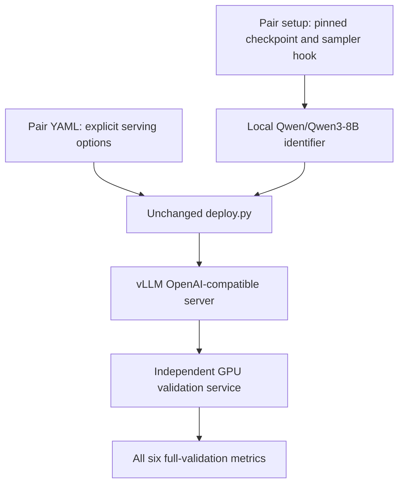

## Qwen3-8B accuracy recovery (KISS spec)

### 1. Requirement analysis

R1. Improve the deployment for (`Qwen/Qwen3-8B`, `rtx3090-oct-22`). Keep its identifiers, pair-slug file names, common entry point, and library format unchanged. Keep the CPU entry and unsupported-pair behavior unchanged.

R2. Reduce VM6 against the validation profile's original-precision baseline. The target is AC6 accepted together with AC1-AC5 in full validation. Do not change the constitution, validator, baseline, datasets, prompts, scorer, or thresholds. If the target cannot be reached, record the measured frontier and retain only a measured improvement that preserves AC1-AC5. Do not claim that untested configurations are impossible.

R3. Test alternative quantized releases of the same original model, starting with weight-only GPTQ or compressed-tensors 4-bit checkpoints. Compare quantization method, group size, runtime precision, tokenizer, chat template, and generation settings. Do not substitute a distilled or fine-tuned model. Do not use validation cases to calibrate weights or create case-specific behavior. A change to default decoding must be explicit in the YAML and apply to all requests unless the caller overrides it.

R4. The setup script must prepare a reproducible checkpoint, pinned by a full HuggingFace revision hash. Use the existing model-identifier materialization mechanism. Setup must be idempotent and fail before updating the identifier if the downloaded snapshot is incomplete. Keep the host sampler setting effective in the deployment's Python process. The script must run with the target environment active.

R5. Use the running validation service on `rtx3090-oct-22`. It creates fresh environments and runs the actual project entry point. Validate exact pushed commits, one request at a time. Only full validation can establish acceptance. Confirm the intended weight format from engine startup output, and record all six metrics, not only accuracy. Preserve baseline and candidate results outside the validator's reused artifact directories.

B1. The checkpoint can already be cached or require download. Both states use the same pinned revision and source.

B2. The model-identifier path can be absent or an existing symlink from a prior setup. Repeating setup must replace the symlink itself, not create links inside its target. Do not alter a shared cache snapshot.

B3. Snapshot preparation can fail or return a directory without config.json. In either case setup fails and leaves an existing identifier unchanged.

### 2. Tests

T1 (R1, R3). Automated: assert pair identity and exact selected options; exercise unsupported-pair rejection and the unchanged CPU entry. Update the old configuration assertion when the selected options change.

T2 (R4, B1, B2). Automated: run the real setup script with isolated offline pip/Python command doubles. Assert that the download requests the selected source and exact revision, that the identifier resolves to the returned snapshot, and that a repeated setup replaces an existing symlink without writing into its target. Check the installed sampler hook.

T3 (R4, B3). Automated: simulate download failure and a snapshot missing config.json. Assert non-zero status and that an existing identifier remains unchanged.

T4 (R2, R3, R5). Integration: full validation of the unchanged merged commit establishes the baseline. Full validation of each retained candidate records VM1-VM6 and statuses. Read engine logs while deployment is active to confirm the checkpoint and kernel. A final candidate must preserve AC1-AC5 and improve AC6. If no candidate does this, make no deployment change and record the measured conclusion.

### 3. Implementation plan

#### 3.1 Implementation repos

`llm-deployment`

#### 3.2 High-level design

The setup script and YAML carry the change. Research and validation are development activities, not runtime configuration search. The setup script does not change model responses based on the validation workload.

The current merged entry uses official AWQ group size 128 and float16. The prior full run measured VM6 5.538932890463419%, VM3 0.007764 s, and VM5 14.484 GiB. These measurements do not exclude a different quantization algorithm or smaller quantization groups. The original and AWQ releases currently have matching generation settings and chat templates; their runtime precision differs.

#### 3.3 Todo list

1. [ ] Write the automated setup and selected-configuration tests.
2. [ ] Run the new tests and confirm the intended failures.
3. [ ] Obtain a fresh full baseline and inspect representative errors and metadata.
4. [ ] Select and pin candidate weight-only quantized checkpoints from the original model.
5. [ ] Implement reproducible, idempotent setup and explicit YAML options.
6. [ ] Run the automated tests and shell syntax checks.
7. [ ] Push exact candidate commits and run service validation sequentially; preserve results and startup evidence.
8. [ ] Retain the best improvement that preserves AC1-AC5; run final full validation.
9. [ ] Record full results and the measured conclusion in validation-results.md, update this spec, and obtain independent review.

#### 3.4 Modification summary

| File | Action |
|------|--------|
| `config/deployment_configurations/qwen_qwen3_8b_rtx3090_oct_22.sh` | Modified: pin the selected source and prepare it safely |
| `config/deployment_configurations/qwen_qwen3_8b_rtx3090_oct_22.yaml` | Modified: record selected serving options and measured rationale |
| `tests/test_deploy.py` | Modified: assert the selected pair configuration |
| `tests/test_rtx3090_setup.py` | New: offline execution tests for setup behavior |
| `.internal/validation-results.md` | Modified: record baseline, candidates, and final full validation |
| `.internal/specs/04-qwen3-8b-accuracy-recovery-kiss-spec.md` | New: requirements, tests, plan, and measured decision |
